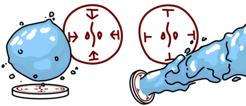
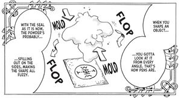
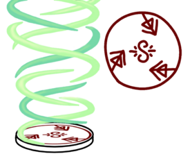
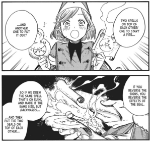
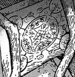
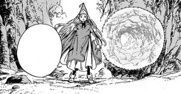
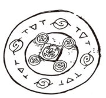
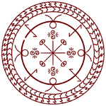

# Magic

Magic is a supernatural force harnessed through the use of seals. Drawn with conjuring ink, seals generate magical effects known as spells. If someone possesses conjuring ink and a means to draw, they can cast magic. Those trained in the art of magic are called witches.

## Seals

To cast a spell, one must first draw a seal. The size and neatness of a seal have a strong effect on the quality of a spell: larger seals are more powerful than smaller ones, and neatly drawn seals are more stable and long-lasting than messy ones. Seals are made from three primary parts: sigils, signs, and rings.

### Sigils

Sigils, typically placed in the center of a seal, control what type of spell a seal will generate. For instance, the pyreball seal, which creates a floating ball of flame, contains a fire sigil, while the watershot seal, which shoots a jet of water, contains a water sigil. While sigils are not required to create a functional spell, the vast majority contain at least one. Regardless of a sigil's size or location within a seal, its behavior will be the same (with specific exceptions).

There are four primary sigils: fire, water, earth, and wind.

| Fire | Water | Earth | Wind |
| :--: | :---: | :---: | :--: |
|  |  |  |  |

All other sigils are either variants of those above or some form of time sigil. Of these, light (a fire variant), crystal (likely an earth variant), and repetition are the most distinct.

| Light | Crystal | Aeriform | Wind Underfoot | Repetition |
| :---: | :-----: | :------: | :------------: | :--------: |
|  |  |  |  |  |

### Signs

While sigils determine spell type, signs control what form spells will take. They serve as modifiers, allowing the effect of a spell to be altered.

Currently, 35 signs have been identified, with more yet to be deciphered. Each one has a unique effect which it can contribute to a spell. Signs have significantly more complexity than sigils in how they can be used and modified. As such, visual aids will be used to help demonstrate their use.

#### Different Signs

The seals pictured below both contain water sigils yet possess different signs. While the seal on the left uses levitation signs to form a "levitating" orb of water, the seal on the right uses column signs to shoot a "column" of water.

#### Sign Balance

While some signs will have fairly consistent effects regardless of their placement in a spell, there are a few signs that, depending on their size, placement, and rotation, will massively alter the direction in which a spell manifests.

When the signs within a spell are unbalanced, the spell will shoot off in unexpected directions. This can be seen in the image above. The seal on the left has column signs which are all the same size, and as such, the same power. This results in a balanced spell that shoots straight up. Conversely, the seal on the right has one column sign which is far longer than the others. This longer sign has more power, causing uneven pressure which makes the spell shoot off to the side. Spells can be made balanced by ensuring they have a high degree of symmetry. Oftentimes, adding more signs to a spell can help to average them out, resulting in a more balanced result. When making seals, it is generally best practice to maintain at least bilateral symmetry to maintain spell stability.

#### Sign Rotation

By tilting the signs within a seal, it is possible to produce a spell that rotates. The more tilted the signs, the more spin but less reach the spell will have.

### Ring

All sigils and signs in a spell must be drawn within or somehow connecting to a spell's outer ring. If they are not, they won't contribute towards the effect of the spell. Spells will only activate if their ring is complete, making it possible to prepare spells ahead of time by leaving a small gap in the ring which can quickly be filled in later. A ring is the bare minimum required to produce a spell. If a ring is the only thing drawn, the spell generated will simply be a rapid discharge of energy, i.e. an explosion.

## Advanced concepts

Beyond the basics of spell construction, there exist concepts and phenomena which expand the options available in spell function and design.

### Sign Inversion

If a sign is flipped around, it will produce an effect opposite to the one it produces normally. Good examples of this can be seen in the Floating Expansion and Spell of Reduction, which grow and shrink objects respectively, as well as between Wall Breaker Seal and Integration, which act to reduce items to dust or reform those items from dust. If there are two spells which are identical to one another but one has its signs inverted, the two spells will cancel out each other's effects, effectively negating their magic. Some forbidden spells seem to not be affected by this phenomenon, however, for reasons currently unknown.

### Linked Spells

When two seals are connected by a line, the effect of their spells will link together and combine. Some seals, such as the sealchair glyph, make use of this to generate complex effects with a large number of unique seals linked together and interacting with one another. On the other hand, sometimes many identical seals will be linked together in order to boost their power. When several small, identical seals are linked together, their combined strength will often be more than would be possible for a single large spell that took up the same amount of space. This allows for very powerful spells to be drawn in small areas, as seen in the Raincleaver. However, drawing such small, intricate spells can be incredibly difficult, so they are difficult to come across.

### Nested Glyphs

It is possible to have seals enclosed within one another, allowing their effects to combine, as is seen in Serpent's Bed of Sand or in the Cloak Spell, this method working for both spells drawn on the same object or spells on separate objects entirely. This technique can be used to boost the power of spells, quickly change part of a spell's effect without redrawing it entirely, or to create much more sophisticated and complex spells than otherwise possible. In nested glyphs, the inner ring will only activate if the outer ring is completed, even if there is no gap in the inner ring. This suggests that seals can somehow tell whether or not they are surrounded by an incomplete ring, only activating if there is no ring surrounding it or if the ring surrounding it is completed. While this behavior is seen in multiple spells, the exact mechanism behind it is unknown.

### Spell Toggling

As a spell will only activate when its ring is closed, it is possible to toggle spells on and off by breaking and completing their ring. To do this, it is necessary to divide the ring of the spell between two separate objects. When the two objects are brought together and properly aligned, the ring will be completed and the spell will turn on, turning off as soon as the halves are separated. This can be seen in contraptions such as the Glowstone Path, which glows only when stepped on, with a person's weight allowing the two halves of the spell to come together.

### Glaives

Neither signs nor sigils, glaives are the claw-shaped protrusions seen on both the memory erasure and slime rendering spells. Nearly forgotten since the Day of the Pact, glaives determine how firmly a spell will imbed itself into one's body. It is unclear if this refers to how deep the effect extends into the body or how thoroughly the effect lodges itself into the body.

## Spells

There are several spells which are in use by witches everywhere, by both Pointed Cap Witches and Brimmed Caps.

Spell List:

- Beast Repellent
- Beldaruit's Smoke Sculpture
- Billow Cluster
- Bird of Light Beacon
- Boulder Stretch Rope
- Cloak Spell
- Crystal Shard
- Floatglow Lamp Seal
- Floating Drops
- Floating Expansion
- Forbidden Flames
- Flying Puppet of Diversion
- Gathering Shadows
- Grasping Wind
- Integration
- Light Beam
- Light-Reducing Spell
- Mirror Spell
- Pyreball Seal
- Rainbringer Seal
- Rainflinger
- Repetition Seal
- Rising Platform of Water
- Rising Wave
- Sand Cage
- Sealchair Glyph
- Serpent's Bed of Sand
- Skysoaring Seal
- Snugstone Spell
- Spell of Reduction
- Sylph Shoes Seal
- Wall Breaker Seal
- Water Bolt
- Watershot Seal
- Water Horse Spell
- Water Pen
- Wind Wall

## Forbidden Magic

Forbidden Magic refers to any magic that is deemed excessively dangerous, has an uncanny amount of power, warps reality itself, or is drawn on/affects the body (including healing magic). They were declared forbidden by the Pointed Hat Witches after the Day of the Pact, and performing forbidden spells will result in expulsion from pointed hat witch society and/or the erasure of memories. The only permitted spell affecting the body is the memory erasure spell.

Forbidden Spells List:

- Anti Scalewolf Curse
- Scalewolf Curse
- Illusory Labyrinth
- Petrification
- Twin Bottle's Spell

## Contraptions

Contraptions are tools created by drawing a seal somewhere onto an item. This gives the item the capability to perform magic on its own, making it a valuable tool for the user. Contraptions are the only way in which Outsiders are able to use magic.

The contraptions:

- Glowstone Path
- Guidance Orb
- Link Rings
- Magic Cookpot
- Mirror Mantle
- Palm Dragon Teacup
- Phantasmal Fireball
- Raincleaver
- Sealchair
- Snugstone
- Split-Shard Bangles
- Sylph Shoes
- Toilet of the Void
- Vapor Bubble
- Washing Barrels
- Windowway

---

Source: <https://witchhatatelier.telepedia.net/wiki/Magic>
