# Sigils Explained

Sigils are a component of seals, special shapes drawn with conjuring ink through which magic can be harnessed in the form of spells. Sigils, typically placed in the center of a seal, control what type of spell a seal will generate. For instance, the pyreball seal, which creates a floating ball of flame, contains a fire sigil, while the watershot seal, which shoots a jet of water, contains a water sigil. The four commonly used elemental sigils are referred to as the primary tetrad. While sigils are not required to create a functional spell, the vast majority contain at least one. Regardless of a sigil's size or location within a seal, its behavior will be the same (with specific exceptions).

## Fire

Fire sigils are responsible for all things related to flame, heat, and light. Currently, there are 3 variants.

### Fire

The base fire sigil (炎の紋, honō no mon) works to create and manipulate flames or heat depending on the spell in question. The base fire sigil is considered one of the four primary tetrad.

**Spells Using Fire:** Flame Shot Seal • Pyreball Seal • Snugstone Spell • Spiraling Flame • Rainflinger • Warmth-Retention Seal

### Unburning Flames

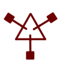

The unburning flames sigil's exact function is unclear, but it is somehow involved in the production of heatless flames as seen in the phantasmal fireball. It is possible that this sigil alone is not enough to produce flames without heat and additional signs are needed, but this is currently unknown.

**Spells Using Unburning Flames:** Phantasmal Fireball

### Light

A variant of the fire sigil, the light sigil (光の紋, hikari no mon) functions to produce magic that manifests in the form of light.

**Spells Using Light:** Bird of Light Beacon • Floatglow Lamp Seal • Wall-Anchored Floatglow Lamp • Light Beam • Light Tracer • Flowers Of Light • Beast Repellent

## Water

Water sigils are responsible for all things pertaining to water. There is currently one variant.

### Water

The water sigil (水の紋, mizu no mon) works to manipulate, collect, and create water. It is worth noting that many water spells meant to be used over long periods collect water rather than create it. This suggests that creating water is more energetically costly than collecting it. The water sigil is considered one of the four primary tetrad.

**Spells Using Water:** Purify • Rainbringer Seal • Rising Platform of Water • Rising Wave • Water Bolt • Watershot Seal • Water Horse Spell • Water Pen • Vapor Bubble Spell • Qifrey's Water Dragon • Rainflinger • Water Orb

## Earth

Earth sigils are responsible for all things pertaining to stone, sand, soil, and wood. There is currently one variant.

### Earth

The earth sigil (地の紋, chi no mon) allows for the manipulation of numerous solid substances, chiefly wood, stone, sand, and soil. However, it does not allow for the creation of these solid materials, as seen when it was used in the earth lift spell. The earth sigil is also known as the sigil of might (力の紋, chikara no mon), and is considered one of the four primary tetrad.

**Spells Using Earth:** Boulder Stretch Rope • Integration • Sand Bridge • Sand Cage • Serpent's Bed of Sand • Wall Bend • Wall Breaker Seal

## Air

Air sigils are responsible for all things relating to air, including its movement, creation, and more. There are currently four variants.

### Wind

The wind sigil (風の絞, kaze no mon) allows for the movement and manipulation, but not the creation, of air. The sigil of wind is also known as the sigil of levitation (浮遊の紋, fuyū no mon) and is considered one of the four primary tetrad.

**Spells Using Wind:** Flying Puppet of Diversion • Grasping Wind • Skysoaring Seal • Wind Wall • Cloak Spell • Floating Drops

### Aeriforms

The aeriforms sigil (気体の紋, kitai no mon) allows for the creation and manipulation (but not movement) of air.

### Wind Underfoot

The exact function of the wind underfoot sigil (足場のある風の紋, ashiba no aru kaze no mon) is not yet clear, but it is known that it helps to somehow support solid objects when they are suspended within air, similar to an air platform. The way this functions or the specifics of the effect are not yet clear.

**Spells Using Wind Underfoot:** Pegasus Carriage Spell • Sylph Shoes Seal

### Whorling Winds

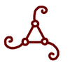

Whorling winds helps to manipulate air through rotation. The exact way in which this functions is unknown, as is the reason for it looking so different to the other air sigils. It being three-sided could indicate a connection to the fire sigil, meaning it might be heating the air as we do with hot air balloons.

**Spells Using Whorling Winds:** Pegasus Carriage Spell

## Time

Time sigils are responsible for magic which manipulates time. There are currently two known time sigils.

### Repetition

Repetition helps to prevent objects from changing by continuously resetting time for the objects it affects to the state they had when the spell first affected them. It is similar to a spring, restoring the object to its original state if that object is somehow changed. This can be used to make soft objects elastic or to prevent things from rotting.

**Spells Using Repetition:** Serpent's Bed of Sand • Capture Pennant Spell • Repetition Seal • Cookpot Lid

### Stop

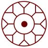

Stop outright halts time for the objects it affects. By pairing it with other sigils, it becomes possible to stop time for specific aspects of an object, such as changes in heat if paired with a fire sigil.

**Spells Using Stop:** Petrification • Time Stop • Warmth-Retention Seal

## Decorative Sigils

Decorative sigils depict living things. Using these, it is possible to either make a spell affect the living thing the sigil corresponds to, create magic in the shape of that living thing, or manifest magic inside things the same shape as what the sigil depicts. It is commonly said that these sigils have no practical utility, so their general use is in decline, now mostly used as decoration or by hobbyists. Decorative sigils used to be classified as signs, but similar to repetition, this was later retconned and they were reclassified as sigils.

### Bird A

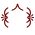

Bird A is a decorative sigil that creates a bird-like projection made from the seal's magic which will fly around for a while. It's only been seen once within the bird of light beacon spell. The front portion of the spell may or may not be a separate sigil entirely. The design was changed in chapter 28. Ideally, the spell's sigil should be placed in the center of this sigil.

**Spells Using Bird A:** Bird of Light Beacon

### Bird B

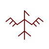

Bird B causes magic to manifest in the shape of a bird, similar to bird A. However, the bird produced by this decorative sigil is noticeably more duck-like compared to bird A.

### Dragon

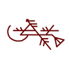

Dragon (巨鱗竜の紋, doragon no mon) causes magic to manifest in the shape of a dragon. The exact dragon species that this decorative sigil imitates is unknown, although the illustration accompanying it appears to be a Dragonpass Isles Wyrm.

**Spells Using Dragon:** Qifrey's Water Dragon

### Flower

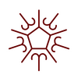

Flower causes magic to manifest in the shape of numerous flowers.

**Spells Using Flower:** Flowers Of Light

### Horse

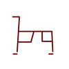

Horse causes magic to manifest in the shape of a horse, as seen in the water horse spell. With the water horse spell, it is possible to pull loads via the water horse, suggesting that this decorative sigil (and perhaps others as well) has the potential for practical usage.

**Spells Using Horse:** Water Horse

### Owlcat

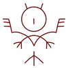

Based on its design, this sigil is likely for forming a full Owlcat (猫梟の紋, neko fukurō no mon) as opposed to just the head of an owlcat, as is the case with the confirmed owlcat head sigil. However, this is yet to be confirmed, and more information is needed.

### Owlcat Head

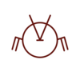

Owlcat (猫梟の紋, neko fukurō no mon) Head causes magic to manifest in the shape of the head of an Owlcat with winter plumage, which is almost spherical in shape. This sigil is identical to the normal owlcat sigil, except it is missing the section corresponding to an owlcat's body. This implies that decorative signs can be split into smaller portions which will form the individual body parts corresponding to that section of the decorative sigil.

### Scalewolf

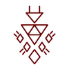

Scalewolf (鱗狼の紋, uroko ōkami no mon) causes magic to manifest in the shape of a scalewolf.

### Torchstag

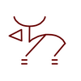

Torchstag (松明鹿の紋, taimatsu shika no mon) causes magic to manifest in the shape of a torchstag.

### Liongoat

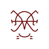

Liongoat (獅子山羊の紋, shishi yagi no mon) causes magic to manifest in the shape of a liongoat.

### Valance Leech

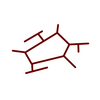

Valance leech (帳蛭の紋, tobari hiru no mon) causes magic to manifest in the shape of a valance leech.

**Spells Using Valance Leech:** Valance Leech Counterlock

## Misc

### Crystal

Crystal allows for the creation and manipulation of crystalline objects. So far, only Richeh has been known to use this sigil, and it has only been used in a few spells.

**Spells Using Crystal:** Crystal Ribbon • Crystal Shard

### Smoke

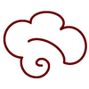

Smoke (煙, kemuri) works to create and generate smoke. It has not been seen whether or not the sigil is also capable of manipulating smoke.

**Spells Using Smoke:** Smoke Cloud

### Guidance

Guidance (誘導の紋, yūdō no mon) functions to attract objects to its location that match parameters set by the other signs and sigils within a spell. For example, a guidance-based spell that contains a Pouch of Calling spell will attract all nearby Pouches of Calling.

> No reference image available — rendered as **G** in the app.

### Calling

Calling (呼び声の紋, tobigoe no mon) echoes back a recorded phrase. So far, it has only been seen in the Pouch of Calling.

> No reference image available — rendered as **C** in the app.
