# Signs Explained

> **Synced from the [telepedia wiki](https://witchhatatelier.telepedia.net/wiki/Signs_Explained) (2026 update).** Notable changes since the last sync: **Bind**, **Solidify**, and **Envelop** are now *officially named* signs; **Radial** may be retconned into **Bind**; **Bend** is now officially **Envelop** (same artwork); **Repetition** was retconned from a sign to a sigil. Sign artwork was re-vectorized from the wiki's current images.

Signs are a component of seals, special shapes drawn with conjuring ink through which magic can be harnessed in the form of spells. Signs control what form a spell will take. They serve as modifiers, allowing the effect of a spell to be altered. Each sign has a unique effect which it can contribute to a spell, with 44 being deciphered so far.

## Sign Categories

Based on their design and behavior, signs can be broken down into four groups: directional signs, semi-directional signs, non-directional signs, and asymmetric signs. These groups are never mentioned, named, or explained within the source material. However, breaking signs into these categories is incredibly useful for understanding how different signs function, so they will be used within this article.

### Directional Signs

Directional signs are signs which manifest their effect in a specific direction, with some examples being column and pull. All directional signs possess bilateral symmetry but lack radial symmetry. By changing the angle, or, in some cases, size of directional signs, one can influence in which direction a spell will manifest. Spells which make use of this property include grasping wind, the skysoaring seal, and the rising platform of water.

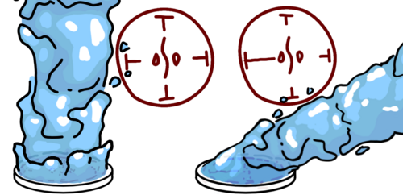
*Changing sign length to alter spell direction*

### Semi-Directional Signs

Semi-directional signs are those which can be inverted yet lack a distinct direction for their effect. Good examples of semi-directional signs include crush and strengthen. Most semi-directional signs possess bilateral symmetry but lack radial symmetry, similar to directional signs. However, some do possess radial symmetry, like rain or enlarge. Changing their size will only alter the strength of their effect, not direction. The direction of the sign doesn't alter the direction of the spell, but if the sign is inverted (facing outwards), the effect of the sign will be the opposite of what it is usually. For semi-directional signs that have radial symmetry, the sign must be flipped inside-out in order for it to be inverted. A pair of spells that makes use of the inversion of semi-directional signs are wall breaker and integration, with wall breaker using crush signs to pulverize while integration inverts them to reform.

### Non-Directional Signs

Non-directional signs are those which lack a direction for their effect and act the same regardless of the direction they point. Examples of non-directional signs include float and crosshair. Lacking bilateral symmetry but possessing radial symmetry, non-directional signs lack a distinct front, back, left, or right. As a result, it isn't possible to invert these signs, as there is no way to have them point inward, as they lack a front with which to point.

### Asymmetric Signs

Lacking symmetry of any kind, asymmetric signs are unpredictable and largely unknown. It is not known if inverting, mirroring, or angling them changes their behavior.

## Officially Named

### Column

Column (柱の矢, hashira no ya) is a directional sign that causes a spell to manifest in a column or beam above the seal. If the signs aren't balanced, the spell will manifest in the direction with the most or the largest signs. The longer line typically faces inwards, as seen in the watershot seal and wall breaker seal. However, the sign is occasionally inverted, as seen in the snugstone seal and crystal shard seal. Inverting the sign seems to make the spell emit out in all directions, similar to dispersion. It is unknown what, if anything, differentiates inverted column's effect from that of dispersion.

*How column emits from a spell with both balanced and unbalanced signs*

**Spells Using Column:** Flame Burst Spell • Flame Shot Seal • Snugstone Spell • Spiraling Flame • Rising Platform of Water • Rising Wave • Watershot Seal • Water Horse • Water Pen • Vapor Bubble Spell • Qifrey's Water Dragon • Water Orb • Sand Bridge • Sand Cage • Serpent's Bed of Sand • Wall Breaker Seal • Pegasus Carriage Spell • Skysoaring Seal • Wind Wall • Floatglow Lamp Seal • Wall-Anchored Floatglow Lamp • Light Beam • Crystal Shard • Repetition Seal • Beast Repellent • Floating Drops • Smokesculpting Seal • Beldaruit's Smoke Sculpture • Forbidden Flames • Forbidden Glow • Illusory Labyrinth • Petrification

### Dispersion

Dispersion (拡散の矢, kakusan no ya) causes the magic of its seal to pour or "disperse" outwards. It isn't known if this sign is directional or semi-directional. It has many similarities to column, with it essentially being a column that leaks its magic outwards rather than shooting or beaming it in a certain direction. Both its normal and inverted variations have been seen, with the difference in their effects being unclear. Interestingly, the effect of inverted column very closely matches that of dispersion, as seen in the snugstone seal. What differentiates the two is currently unknown.

**Spells Using Dispersion:** Water Pen • Bird of Light Beacon • Petrification

### Levitation

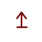

Levitation (浮遊の矢, fuyū no ya) is a directional sign that has two apparent functions, these depending on the sigil which is paired with the sign. The reason for this is unknown. The arrow-like side of the sign typically faces inwards.

For water, fire, and light spells, levitation causes the spell's effect, as well as objects held overtop the seal, to levitate in the air. This can primarily be seen in the pyreball seal and the wall-mounted floatglow lamp seal. The size of the levitation signs dictate the weight of the objects which can be held aloft, while the size of the seal's sigil determines how powerful the floating magic generated will be.

For air and wind spells, levitation will cause the object on which the spell is drawn to move through the air. The direction of this movement depends on which way the signs point, but due to a drawing error where the direction of the skysoaring seal was reversed between two panels, it was unclear in which direction this movement occurs. This changed with the release of the anime, which confirmed that movement is in the direction of the arrow.

**Spells Using Levitation:** Pyreball Seal • Rising Platform of Water • Pegasus Carriage Spell • Sylph Shoes Seal • Wall-Anchored Floatglow Lamp • Beldaruit's Smoke Sculpture

### Pull

Pull (引き寄せの矢, hikiyose no ya) is a directional sign that causes anything matching its seal's sigil (water, air, fire, etc.) to be pulled towards the seal when the arrow portion of the sign is pointing inwards. It is likely that, if inverted, the sign will instead push things away. When pointed inwards at an angle, the spell will have both a pulling and twisting effect, and it's likely that if rotated a full 90 degrees, the spell will just twist without pulling.

**Spells Using Pull:** Flame Burst Spell • Wall Bend • Grasping Wind

### Crush

Crush (破砕の矢, hasai no ya) is a semi-directional sign that breaks things apart. When paired with an earth sigil, crush will cause objects to disintegrate, breaking them into tiny pieces until they reach a sand-like or powdered state. If the sign is inverted and the spell is used on a powdered substance, the powder will reform into its original shape. However, as soon as the spell wears off or the spell is removed, the powder will return to simply being a pile of dust.

As crush has only ever been seen paired with an earth sigil in the manga, it is unclear how it would behave if used with other seals. In episode 7 of the anime adaptation, however, it is pointed out that Coco's wall breaker spell was also "crushing the water" into mist. It has also been proposed that, if paired with a crystal sigil, it may behave in the same manner as when paired with earth, just limited to only affecting crystalline objects. However, this theory is currently unproven and, for now, remains conjecture.

**Spells Using Crush:** Integration (Inverted) • Sand Cage (Inverted) • Serpent's Bed of Sand • Wall Breaker Seal • Smokesculpting Seal (Inverted)

### Float

Float is a non-directional sign that will make things float in midair, seemingly letting them ignore gravity.

In most cases, float only levitates the object on which the seal is drawn. However, there have been five instances where this has not been the case. Of these instances, two have since been retconned — these are the pyreball seal and an unnamed spell from chapter 3, the spells having their float signs replaced with levitation signs in chapter 8 and the English release of volume 1 respectively. This, combined with the third instance, the fish guidance spell, requiring float to be paired with crosshair in order to levitate the spell's target, suggests that float can't levitate things on which it isn't drawn unless given explicit instructions to do so. If this is to be believed, it would suggest that the design of the fourth instance, the floatglow lamp seal, is flawed, as not only does this spell (which contains column signs) produce a ball of light rather than a light beam, the magic of the spell also floats. However, the final instance, the earth lift spell, makes use of column and float to levitate the ground beneath the spell, further confusing the matter in which float is meant to function.

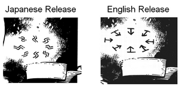
*Comparison of the float signs between the Japanese release and English release of volume 1*

**Spells Using Float:** Floatglow Lamp Seal • Fish Guiding Seal • Floating Expansion

### Region

Region (領域の矢, ryōiki no ya) is a directional sign that determines where magic will manifest in relation to a seal. For instance, if the region signs within a seal all point to the same side of the spell, the magic will shoot in that direction. Similarly, if all of the region signs within a spell point inwards, the magic will only manifest within the ring of the seal, and if they all point outwards, the magic will manifest outside the ring while not taking effect at all within the bounds of the seal. Interestingly, if region signs are arranged so that they are pointing towards one another, both towards the center and exterior of the seal in opposition to one another, the magic will only manifest directly on the ring of the seal, as can be seen in the floating drops spell.

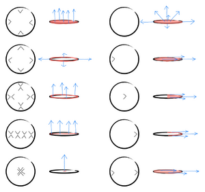
*How configurations of region signs manifest, with the spell emitting from the red regions and the arrows showing its direction.*

**Spells Using Region:** Flame Shot Seal • Rising Wave • Water Bolt • Makeover Mask Spell • Cookpot Lid • Illusory Labyrinth

### Convergence

Convergence (収束の矢, shūsoku no ya) causes the magic of its spell to "converge," centering down to a single point. The sign could be semi-directional based on its behavior in the wall of wind spell. It is unclear exactly how convergence focuses magic, but the effect of spells such as wall of wind and the wall-anchored floatglow lamp suggest that it might make the magic manifest about or from a single point. The sign can also make loose particles pack tightly together and become somewhat rigid, as explained by the disciples of Qifrey's Atelier when they were designing the serpent's bed of sand. One of the triangle's points is typically seen pointing inwards.

**Spells Using Convergence:** Qifrey's Water Dragon • Serpent's Bed of Sand • Sylph Shoes Seal • Wind Wall • Wall-Anchored Floatglow Lamp • Repetition Seal • Light-Reducing Spell • Cookpot Lid

### Collection

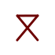

Collection will collect material located above and around the seal, allowing it to be used by a spell. It is either directional or semi-directional and has never been seen inverted. The open side is typically seen facing inwards.

**Spells Using Collection:** Purify • Billow Cluster

### Billow

Billow (もくもくの矢, mokumoku no ya) is a non-directional sign that allows a spell to produce a fluffy cloud that is said to be extremely comfortable to sit on. Collection (or something similar) is supposedly needed to collect and convert certain materials into clouds, but there seem to be some materials that cannot be converted. Similar to repetition, billowing can take the place of a sigil within a spell. Its only appearance has been within the Serpent's Bed of Sand, so the exact details of how it works aren't quite clear.

**Spells Using Billow:** Serpent's Bed of Sand • Billow Cluster

### Repetition

Repetition (くりかえしの矢, kurikaeshi no ya) continually resets objects affected by the spell to their previous state, essentially rewinding time. This can be used to keep food from rotting and even to clean clothes, not to mention many other uses it has. As of the bonus from Volume 12, the status of repetition has been retconned from that of a sign to a sigil, but as a sign, it was considered non-directional.

**Spells Using Repetition:** Serpent's Bed of Sand • Capture Pennant Spell (Sigil) • Repetition Seal

### Weave

The weave sign (also known as ribbon) can turn solid objects affected by the spell into long, flexible ribbons upon contact with the seal. It is most likely semi-directional, but has never been seen inverted. It was invented by Richeh and is used in her ribbon spells. This sign is supposed to surround the central sigil.

**Spells Using Weave:** Boulder Stretch Rope • Light Tracer • Crystal Ribbon

### Cool

Cool (冷やす矢, hiyasu ya) is a non-directional sign that presumably cools things down. First introduced in the volume 12 bonus, it is featured in the vapor bubble spell, presumably to either make the water cooler to drink or to help it condense from the air for the contraption to gather.

**Spells Using Cool:** Vapor Bubble Spell

### Strengthen

> **Official name (World Guide 2026): Sign of Empowerment** — JP "reinforcement vector" = strengthen/reinforce; note it may empower *effects*, not only physical durability ([world-guide-2026.md](world-guide-2026.md)).

Strengthen (強化の矢, kyōka no ya) presumably makes objects stronger and more durable. It is most likely semi-directional, but has never been seen inverted. Introduced in the volume 12 bonus, it is a component of the capture pennant spell, helping to make the banner of a Knight's capture pennant more durable.

**Spells Using Strengthen:** Capture Pennant Spell

### Sights Set

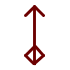

> **Official name (World Guide 2026): Sign of Focus** — JP "aiming vector" = set/lock a target ([world-guide-2026.md](world-guide-2026.md)).

Sights set (照準の矢, shōjun no ya) is most likely a directional or semi-directional sign and has never been seen inverted. First seen in the capture pennant spell, it is highly peculiar. Aside from the puppet sign, it appears to be the only sign that allows a spell to be controlled via one's mind. Specifically, it seems to serve the function of aiming a spell at some point or target. For example, its inclusion on the aforementioned capture pennant spell likely allows a knight to target a specific object or person for their capture pennants to wrap around.

**Spells Using Sights Set:** Spiraling Flame • Capture Pennant Spell

### Entwine

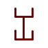

> **Official name (World Guide 2026): Sign of Entwining** — JP "coiling vector" = wrap/coil around something ([world-guide-2026.md](world-guide-2026.md)).

Entwine (巻きつきの矢, maki-tsuki no ya), first seen in the capture pennant spell, functions to somehow make an object it is drawn on (such as a ribbon) wrap or "entwine" itself around other objects. The mechanism through which this is achieved is unknown. It is most likely a semi-directional sign and has never been seen inverted.

**Spells Using Entwine:** Capture Pennant Spell

### Sign of Wind

The sign of wind (風の矢, kaze no ya) is an asymmetrical sign with a strange history. Prior to the volume 12 bonus, it had only ever made an appearance in chapter 1. In this chapter, the sign seemed to serve the same purpose as the wind sigil, serving as a sigil for both the sylph shoes seal and the pegasus carriage spell. However, with the sign not appearing in any subsequent chapters and even being replaced within the sylph shoes, fans believed the sign to have been a retconned version of a wind sigil. However, with its inclusion in the pegasus carriage spell reaffirmed as of the volume 12 bonus, it is now clear that the sign is still canon. Its function, beyond its relation to wind, is unclear.

> **Note (whirlwind keystone).** Spiraling Flame gives the clearest evidence of the sign's effect: when Agott casts it she explicitly calls it a *"whirlwind keystone"* (*"if I use this fire rune spell with a whirlwind keystone, then…"*), and the spell's documented effect is *"a column of spinning flame."* So in Spiraling Flame the sign of wind is what sets the column **spinning into a spiral** — i.e. it acts as a whirlwind/spin operator. This may not generalize: in the pegasus carriage spell the same sign appears to serve as a plain wind sigil instead. Treat its role as "whirlwind / spin" where canon supports it, and "unclear" otherwise.

**Spells Using Sign of Wind:** Spiraling Flame • Pegasus Carriage Spell

### Aeriforms Defined

Aeriforms defined (気体の示す矢, kitai o shimesu ya) is somewhat confusing thanks to the conflicting nature of its name and design. There are two basic variants of the base wind sigil: wind and aeriforms. The wind sigil makes a spell move air, while aeriforms causes a spell to create air. Confusingly, aeriforms defined has the same design as the modifiers on the wind sigil, yet shares a name with the aeriforms sigil. This conflicting information makes it difficult to determine the function of the sign, though it is known that it can serve as a modifier to the wind underfoot sigil, as seen in the pegasus carriage spell. The sign is most likely semi-directional and has never been seen inverted.

**Spells Using Aeriforms Defined:** Pegasus Carriage Spell

### Gather

> **Official name (World Guide 2026): Sign of Gathering** — JP "gathering vector" ([world-guide-2026.md](world-guide-2026.md)).

Gather (集める矢, atsumeru ya) seems to serve a very similar function and design to collection, letting a spell use material from its surroundings to construct its effect. How it differs is unclear, but gather may be less passive than collection and actively draw material in rather than just collect things nearby. This, however, is unconfirmed. The sign is seen in the vapor bubble spell. The sign is either directional or semi-directional and has never been seen inverted.

**Spells Using Gather:** Vapor Bubble Spell

### Glaives

Glaives function to determine how deeply magic will embed itself into an animal's flesh. They are most likely semi-directional and have never been seen inverted. They likely date back to before the Day of the Pact, and have only ever been seen in the memory erasure spell variants and the slime rendering seal drawn by Engendale. Interestingly, it is possible that glaives aren't classified as signs based on Engendale's comments regarding them, but how exactly this is the case is left unclear.

**Spells Using Glaives:** Memory Erasure • Slime Rendering Seal

### Solidify

Solidification (凝固の矢) likely causes the magic drawn within or connecting to it to become more solid. The sign can be written both on its own and with signs/sigils/seals written within one of its circles, and warrants the same effect either way (a rule of thumb to tell it apart from linked seals). It is unclear whether the lines must be straight or whether multiple of its circles can be occupied.

**Spells Using Solidify:** Raincleaver • Sand Bridge

### Bind

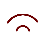

Bind (留める矢) — based on its name and its use in Raincleaver — may halt the movement of material and bind it together, causing it to act and be moved as a single unit. **This sign may be the same as what was previously known as "Radial."** (Promoted to an officially-named sign in the wiki's 2026 update; the older fan reading of "Bind" as a glue-like sign in Wall Bend is superseded.)

**Spells Using Bind:** Raincleaver

### Envelop

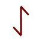

Envelop (衣まといの矢) likely causes a magic effect to envelop or surround what it is targeting. In Raincleaver it is likely what causes the water to wrap around the entire sword rather than just manifesting out of the seals, and it has a similar effect in Gathering Shadows. **This is the officially-named successor to the fan-named "Bend" sign** (same artwork) — see Bend below.

**Spells Using Envelop:** Raincleaver • Gathering Shadows • Cloak Spell • Petrification

## Unofficially Named

### Diamond

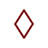

Diamond can be found within the spell of reduction used on the period piece contraption, which uses an inverted enlarge sign to make nearby objects shrink. The sign is non-directional. By comparing this spell to the floating expansion spell, which also contains an enlarge sign, it is possible to isolate diamond's effect. Most likely, diamond will cause a spell to only affect nearby objects while not affecting the object the spell is drawn on.

**Spells Using Diamond:** Spell of Reduction

### Window

Window (窓の矢, mado no ya) can be found at the center of the floating expansion spell, which makes use of an enlarge sign to make the object it is drawn on grow in size. The sign is non-directional. By comparing this spell to the spell of reduction, which also contains an (albeit inverted) enlarge sign, it is possible to isolate window's effect. Most likely, window will cause a spell to only affect the object it is drawn on.

**Spells Using Window:** Floating Expansion

### Enlarge

Enlarge is a semi-directional sign that will cause objects to grow in size (or shrink if inverted). Whether it causes a change in size to just the object it is drawn on or just to objects nearby is seemingly controlled by the presence of either a window or diamond sign respectively. It causes objects to either grow (corners point outwards) or shrink (corners point inwards). A sign may or may not be needed, but it would have to be placed in the center regardless.

**Spells Using Enlarge:** Qifrey's Water Dragon • Spell of Reduction (Inverted) • Floating Expansion

### Crosshair

Crosshair is a component of the rainflinger seal. The sign is non-directional. Likely it functions to cause magic to only target and/or manifest in objects with a corresponding magic aspect.

**Spells Using Crosshair:** Rainflinger • Fish Guiding Seal

### Radial

Radial is a component of the snugstone spell. While its exact function is unclear, it likely serves to decrease the power of the spells it is used in, such as converting fire into heat. It is most likely semi-directional and has never been seen inverted.

> **Possible retcon (wiki 2026):** Radial may have been retconned and is now known officially as **[Bind](#bind)** (留める矢). Treat the two as likely the same sign pending confirmation.

**Spells Using Radial:** Snugstone Spell • Sand Bridge

### Bolt

Bolt is a component of the water bolt spell. It is a non-directional sign. Bolt causes the magic of its spell to manifest in the form of bolt-like projectiles. When paired with a region sign, which controls the spell's direction, the projectiles will be shot with dangerous speed.

**Spells Using Bolt:** Water Bolt

### Eye

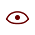

Eye is a sign that has only been seen three times: twice within variants of the gathering shadows spell (in Sasaran's cloak and Euini's mirror mantle), and once more as a component of the spell on the makeover mask. In tandem with the vision sign, eye seems to have some form of effect relating to the formation of illusions and the manipulation of light. What eye does on its own, however, is unknown, as it has never been seen in isolation. It is likely that this sign is actually a sigil.

**Spells Using Eye:** Gathering Shadows • Makeover Mask Spell • Cloak Spell

### Vision

The vision sign has been seen four times in total: twice within variants of the gathering shadows spell (in Sasaran's cloak and Euini's mirror mantle), once on the light-reducing spell from Qifrey's glasses, and a final time within the makeover mask spell. When paired with eye signs, as is the case in gathering shadows and the makeover mask spell, vision seems to have the ability to create illusions. However, when vision is separate from the eye sign, as is the case in Qifrey's glasses, it can be used as a component in spells intended to aid in sight. While its exact function is unclear, its usage strongly suggests some form of relation to visual perception and sight. It is likely that this sign is actually a sigil.

**Spells Using Vision:** Gathering Shadows • Makeover Mask Spell • Cloak Spell

### Rain

Rain causes its spell to produce an effect very similar to rainfall down into its immediate area. It may be limited to only water spells, but it would likely work with other sigils such as fire or light to create firework-like effects, or possibly even generating a lava rain with a pairing of fire and earth. This sign is meant to surround the central sigil, which is placed in the empty space at its center. As rain can be turned inside out to reverse its effect, it is considered semi-directional.

**Spells Using Rain:** Rainbringer Seal

### Puppet

Puppet (踊る人形の矢, odoru ningyō no ya) is highly unusual, appearing to be the only sign (aside from sights set) that allows one to control a spell with their mind. More specifically, puppet seems to allow a "user" (possibly either the person who drew or last touched the spell) to control the movement of the object it is drawn on. The nature of this movement seems to be dependent on the sigil of the spell. For example, wind-based puppet spells, such as the flying puppet of diversion and cloak spell, only seem to be capable of aerial movement. While it is never stated, directly or otherwise, that puppet spells move in accordance with the user's mind, there is strong circumstantial evidence to support the idea. For example, Sasaran was able to maneuver his cloak with incredible accuracy and precision during his fight with Qifrey. With his cloak lacking any visible controls through which this could be explained, it is reasonable to assume that he piloted it using his mind. Interestingly, the sealchair, which is similar to Sasaran's cloak in that it lacks visible controls yet can still be operated with clear precision and intent, features a number of signs on its underside which closely resemble puppet. It is possible that these are variants. It is possible that puppet can be turned inside out to reverse its effect, in which case it would be considered semi-directional. However, this is currently unknown.

**Spells Using Puppet:** Flying Puppet of Diversion • Cloak Spell

### Orb

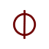

Orb, a non-directional sign, has the effect of creating a spherical space above a seal within which the material the spell controls will collect. Material will only collect in this area if it is added in directly. Material will fill this space bottom to top, collecting at the bottom of the spherical region, still affected by gravity. When more material is added, it will gradually fill the space higher and higher in the same way you would see in a bucket or a cup. It is seen one time in a spell Qifrey uses to create a sphere of water, achieving this by pouring it into the spherical region of the spell directly.

**Spells Using Orb:** Water Orb

### Purify

Purify is an asymmetric sign found in both the Purify spell and the sewer grate purifier. It functions to separate out any impurities from the magic of its sigil. For example, it will separate out particulates and contaminants from water or dust from air. These separated substances will accumulate near the spell.

**Spells Using Purify:** Purify

### Link

The exact effects of Link are unknown, but it is confirmed that this sign functions to somehow link magic between the object it is drawn on and all other objects that were broken off, removed from, or made out of the same original object. For example, the split-shard bangles are rings all carved from fragments of the same original crystal. Constructed from a light sigil, a weave sign, and a link sign, the spell on the rings will create a ribbon of light between the ring it is drawn on and all other rings constructed from that crystal. What a link spell would be like paired with a sign other than weave, however, is unknown. Link is most likely a semi-directional sign and has never been seen inverted.

**Spells Using Link:** Light Tracer

