# Spells

In Witch Hat Atelier, magic is performed via drawn spells or seals. Spells are typically composed of one or more Sigils and Signs, which control the spell's behaviour, as well as a surrounding Ring which, once fully connected, serves to activate the spell. Closing an empty spell ring with no Sigils or Signs results in a large shockwave, destroying the seal in the process. These symbols must be drawn using Woodcruor of some kind.

Composition and accuracy play a large part in the outcome of the spell, with smaller or messier seals being weaker or shorter-lived than larger or neater ones. The same principle applies to the Signs as well. Some spells may even fail to activate if the ring is not circular enough.

However, many small seals can be linked together to replicate the strength of a larger one. This can be useful in situations where drawing a large seal accurately would be impractical or impossible, or to conceal the spell for use in a contraption.

They usually fall into one of five main groups — fire, water, earth, wind, and light — depending on which Sigil they possess.

Unfortunately, the designs of some seals have been somewhat inconsistent, so a few spells have a different spell construction now than they did earlier on in the story (this is especially prevalent in the first and second volume chapters). One example of this is how the Wall Breaker seals early on in the manga have a levitation sign in place of an earth sigil, though it was somewhat fixed for the volume release. Due to this and similar cases, if a seal has different forms at different points in the story, the newer version of that seal will take precedence and become the official form of that seal.

## Fire Spells

Fire spells are spells that are based around a fire sigil.

| Flame Burst Spell | Flame Shot Seal | Phantasmal Fireball | Pyreball Seal | Snugstone Spell | Spiraling Flame |
| :--: | :--: | :--: | :--: | :--: | :--: |
|  | 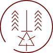 |  | 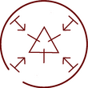 | 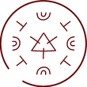 | 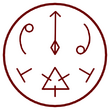 |

## Water Spells

Water spells are spells that are based around a water sigil.

| Purify | Rainbringer Seal | Rising Platform of Water | Rising Wave | Water Bolt | Watershot Seal | Water Horse Spell | Water Pen | Vapor Bubble Spell | Qifrey's Water Dragon | Water Orb |
| :--: | :--: | :--: | :--: | :--: | :--: | :--: | :--: | :--: | :--: | :--: |
| 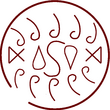 |  | 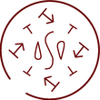 | 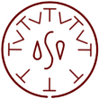 | 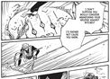 | 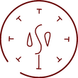 | 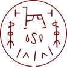 |  | 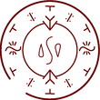 | 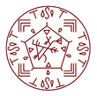 | 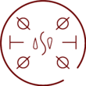 |

## Earth Spells

Earth spells are spells that are based around an earth sigil.

| Boulder Stretch Rope | Integration | Sand Cage | Serpent's Bed of Sand | Wall Bend | Wall Breaker Seal |
| :--: | :--: | :--: | :--: | :--: | :--: |
| 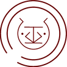 |  | 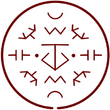 | 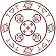 |  |  |

## Wind Spells

Wind spells are spells based around one or more of the varieties of wind sigil.

| Flying Puppet of Diversion | Grasping Wind | Pegasus Carriage Spell | Skysoaring Seal | Sylph Shoes Seal | Wind Wall |
| :--: | :--: | :--: | :--: | :--: | :--: |
|  | 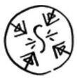 | 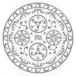 | 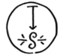 | 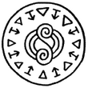 | 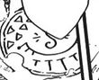 |

## Light Spells

Light spells are spells based around the light sigil. As stated by Olruggio, light magic is technically a variant of fire magic, but it is distinct enough in its usage and design to get its own category.

| Bird of Light Beacon | Floatglow Lamp | Wall-Anchored Floatglow Lamp | Light Beam | Light Tracer | Flowers of Light |
| :--: | :--: | :--: | :--: | :--: | :--: |
| 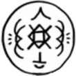 | 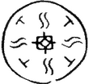 | 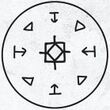 | 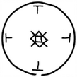 | 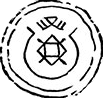 | 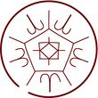 |

## Crystal Spells

Crystal spells are spells based around the crystal sigil. It's possible that crystal is a variant of earth in a similar way to light being a variant of fire, but this is unknown.

| Crystal Ribbon | Crystal Shard |
| :--: | :--: |
|  | 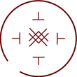 |

## Time Spells

Time spells are spells based on time magic.

| Capture Pennant Spell | Counterclock | Repetition Seal | Spell of Reduction | Time Stop | Valance Leech Counterclock |
| :--: | :--: | :--: | :--: | :--: | :--: |
| 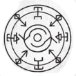 | 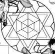 | 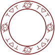 | 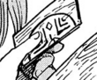 | 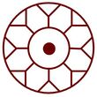 | 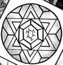 |

## Vision Spells

Vision spells are spells using the vision sigil which somehow alter perception or vision. Oftentimes, they deal in illusion.

| Gathering Shadows | Light-Reducing Spell | Makeover Mask Spell |
| :--: | :--: | :--: |
| 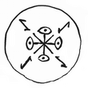 | 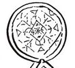 | 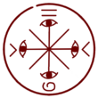 |

## Mixed Spells

Mixed spells are spells consisting of two or more separate sigils.

| Beast Repellent | Cloak Spell | Floating Drops | Rainflinger (Drying) | Rainflinger (Normal) | Warmth-Retention Seal |
| :--: | :--: | :--: | :--: | :--: | :--: |
| 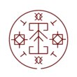 | 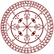 |  | 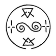 | 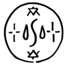 |  |

## Niche Spells

Niche spells are spells that don't fit into any specific category, with sigils that aren't one of the main five (water, earth, fire, wind, light) and aren't forbidden.

| Billow Cluster | Cookpot Lid | Fish Guidance | Floating Expansion | Inverted Scalewolf Curse | Lockwax | Memory Erasure | Mirror Spell | Pouch of Calling | Sand Bridge | Sealchair Glyph | Tracking Spell | Smokesculpting Seal | Windowway Spell | Enchanted Doorknob Seal | Smoke Cloud |
| :--: | :--: | :--: | :--: | :--: | :--: | :--: | :--: | :--: | :--: | :--: | :--: | :--: | :--: | :--: | :--: |
| 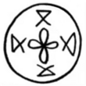 |  | 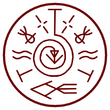 |  | 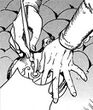 |  | 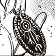 | 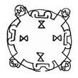 | 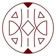 |  | 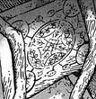 | 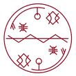 | 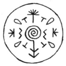 |  |  |  |

## Unknown Spells

Unknown spells are the spells that, for whatever reason, we don't know enough about to put in any category. Spells in this section typically don't have their glyph visible, are potentially forbidden, have glyphs that are incomplete or hard to make out, or simply do not fit well into other categories.

| Beldaruit's Smoke Sculpture | Forbidden Flames | Spike | Forbidden Glow |
| :--: | :--: | :--: | :--: |
|  |  |  |  |

## Forbidden Spells

Forbidden Spells are spells that were outlawed by the Pointed Cap Witches and are used by the Brimmed Caps. Using them can result in getting your memory wiped by the Knights Moralis.

| Anti Scalewolf Curse | Illusory Labyrinth | Petrification | Scalewolf Curse | Slime Rendering Seal | Twin Bottle's Spell |
| :--: | :--: | :--: | :--: | :--: | :--: |
|  |  |  |  |  |  |

---

Source: <https://witchhatatelier.telepedia.net/wiki/Spells>
